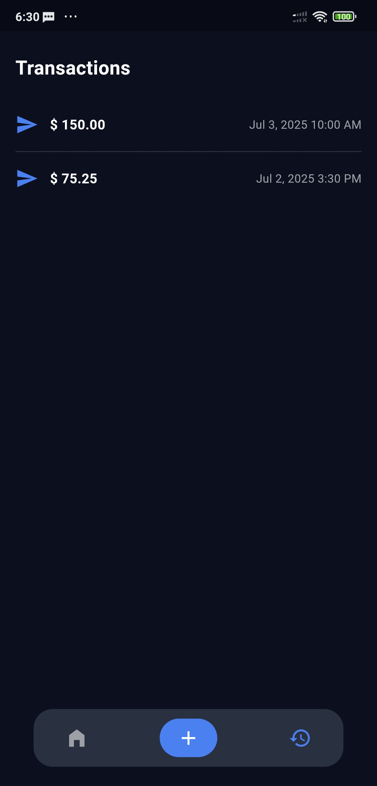

# money\_app

A Flutter application for sending money, viewing wallet balance, and transaction history.

## Features

* **Wallet Balance**: Shows current balance with show/hide toggle.
* **Send Money**: Enter an amount, submit via slide action, with success/failure dialog.
* **Transaction History**: View past transactions with details and timestamps.
* **Clean Architecture**: Separates UI, business logic, and data layers.
* **Bloc & Cubit**: State management using flutter\_bloc.

## Screenshots


|                      Splash Screen                      |                       Home Screen                        |                      Send Money                       |
|:-------------------------------------------------------:|:--------------------------------------------------------:|:-----------------------------------------------------:|
|  |     |  |
|                      Send Success                       |                   Transaction History                    |                                                       |
|  |  |                                                       |

## Getting Started

Follow these instructions to run the app and unit tests on your machine.

### Prerequisites

* [Flutter SDK](https://flutter.dev/docs/get-started/install) (>=3.0.0)
* Android Studio or Xcode (for simulators/emulators)
* A connected device or simulator/emulator

### Installation

1. Clone the repository:

   ```bash
   git clone https://github.com/sayujsujeev/money_app.git
   cd money_app
   ```
2. Install dependencies:

   ```bash
   flutter pub get
   ```

### Running the App

Launch the application on a connected device or emulator:

```bash
flutter run
```

### Running Unit Tests

This project includes unit tests for all Cubits using `bloc_test` and `mocktail`.

To execute the tests:

```bash
flutter test
```

## Project Structure

```
lib/
├── core/           # Shared utilities & dependency injection
├── features/
│   └── home/
│       ├── data/   # API & repository implementations
│       ├── domain/ # Entities & use cases
│       └── presentation/
│           ├── bloc/   # Cubits & states
│           └── pages/  # UI screens
test/                # Unit tests mirroring lib/ structure
```

